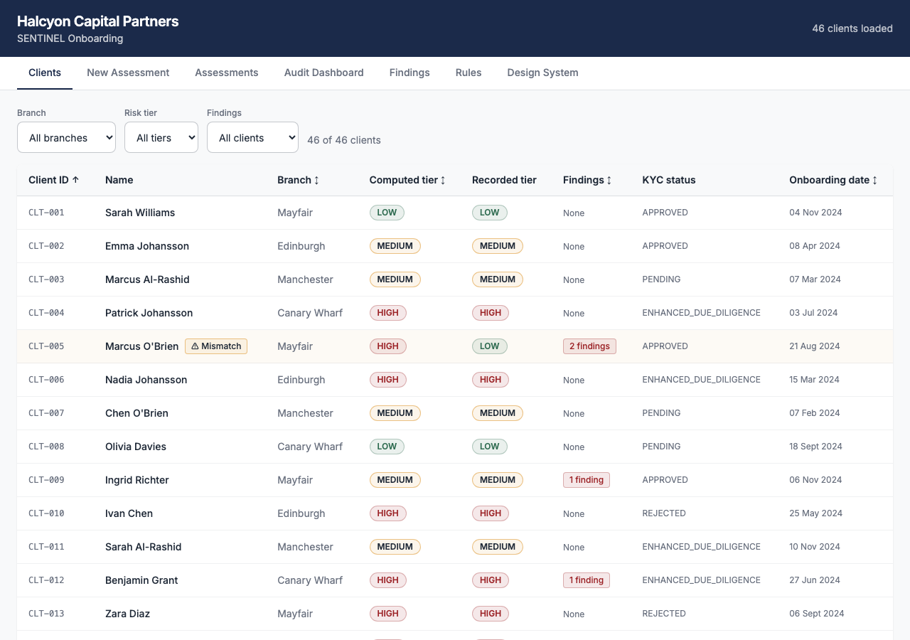
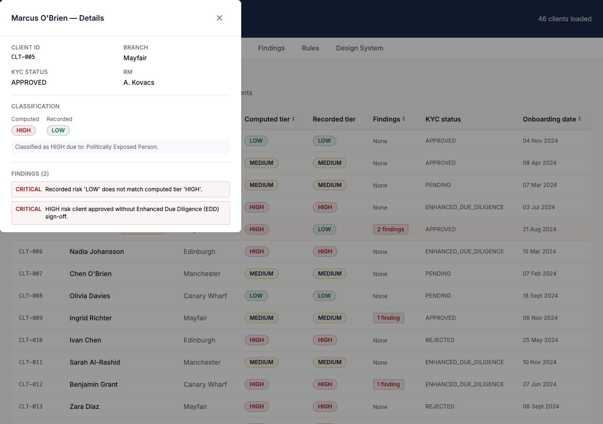
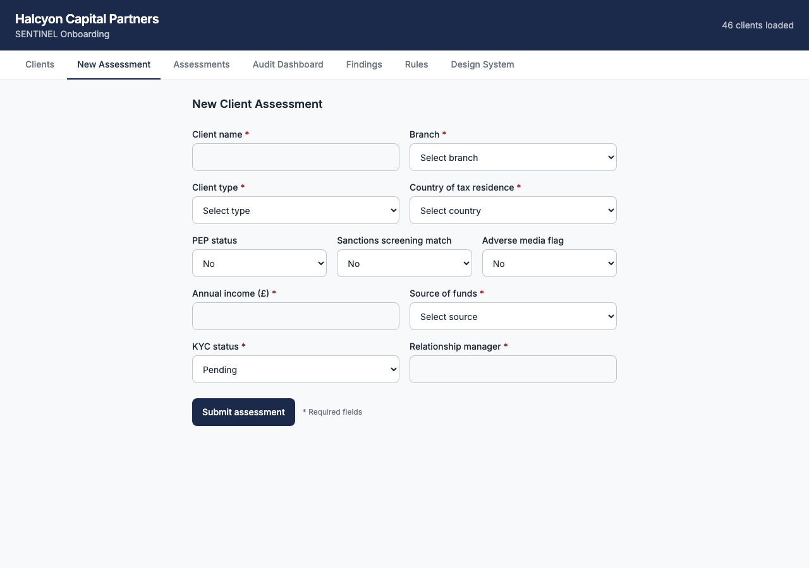
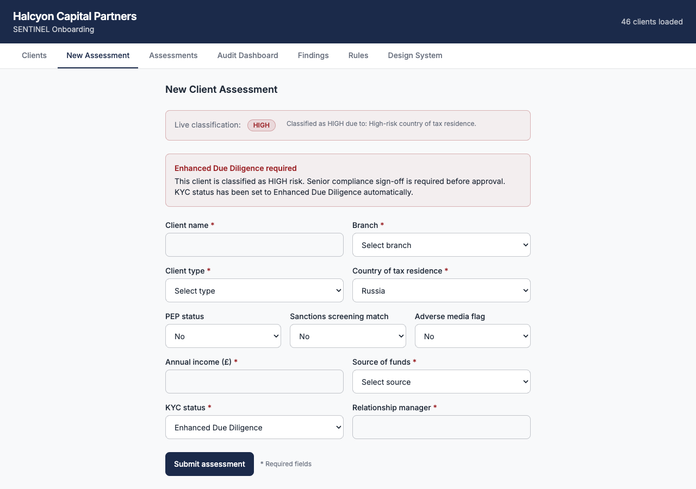
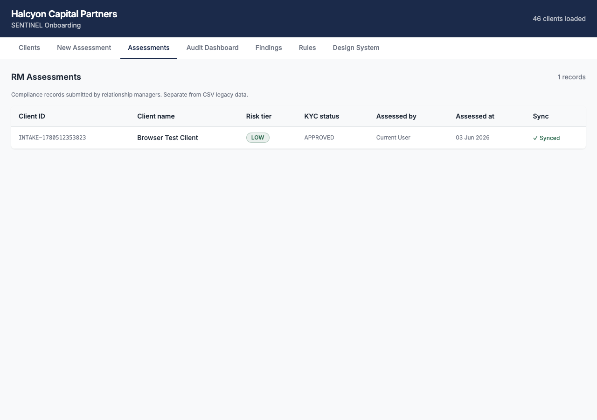
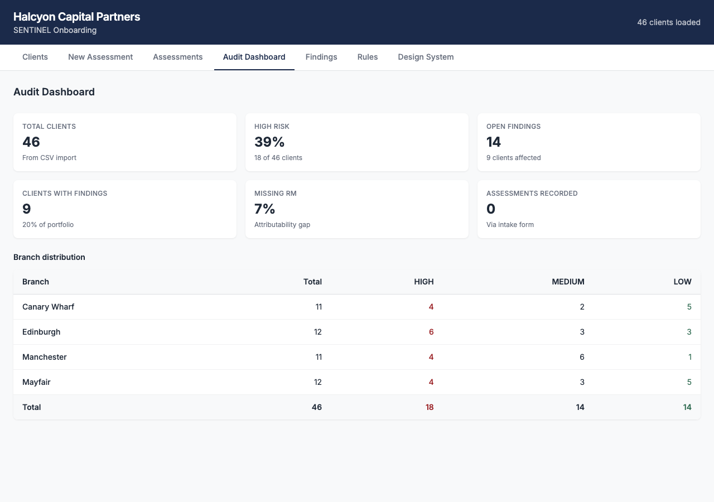
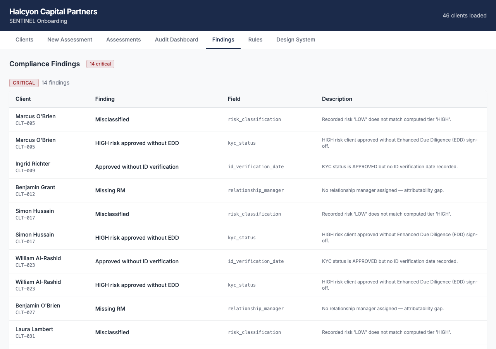
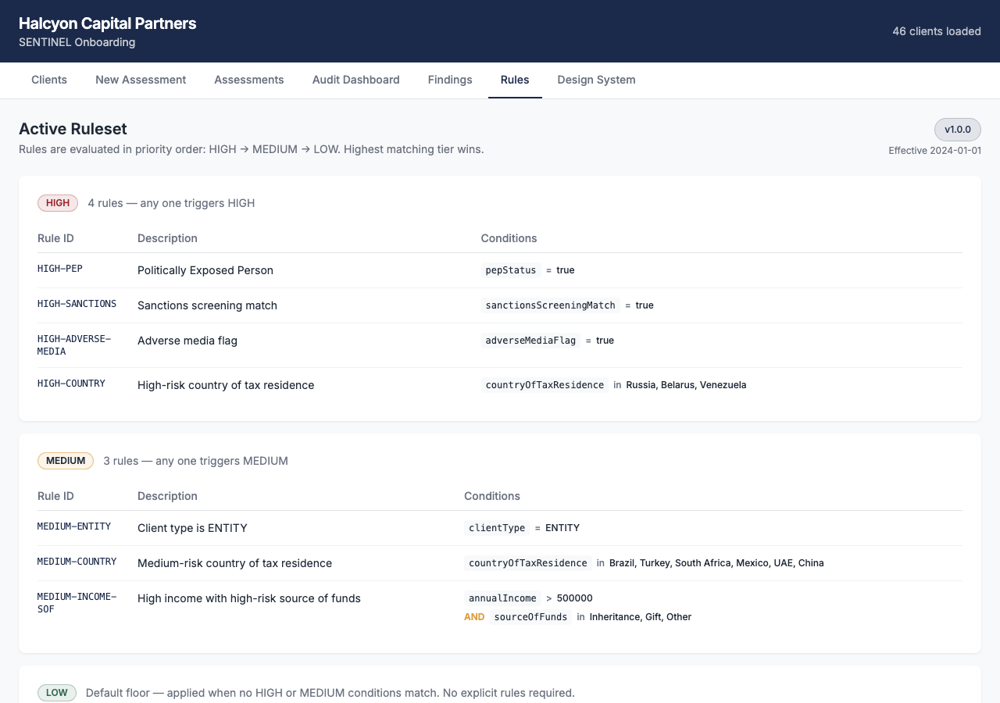

# SENTINEL Onboarding

SPA prototype for client risk classification during onboarding.
Halcyon Capital Partners — SENTINEL programme.

**Live preview:** [sentinel-onboarding-peach.vercel.app](https://sentinel-onboarding-peach.vercel.app)

## Stack

- Vite + React 18 + TypeScript (strict)
- Tailwind v4 (CSS-first `@theme`, no config file)
- Supabase (behind `ComplianceRepository` interface)
- Vitest + Testing Library + jest-axe

---

## Screenshots

| Screen | Description |
|--------|-------------|
|  | **Clients** — 46 CSV records, sortable/filterable table. CLT-005 flagged with ⚠ Mismatch badge (recorded LOW vs computed HIGH). |
|  | **Client detail dialog** — CLT-005: Computed HIGH / Recorded LOW, 2 CRITICAL findings shown inline. |
|  | **New Assessment** — intake form with live risk classification panel. |
|  | **HIGH risk flow** — Russia selected → live badge switches to HIGH, EDD notice appears, KYC auto-set to Enhanced Due Diligence. |
|  | **Assessments** — compliance records saved via intake form; sync status badge (LOCAL / SYNCED). |
|  | **Audit Dashboard** — KPI cards (46 total, 39% HIGH, 14 findings) + branch distribution table. |
|  | **Findings** — 14 CRITICAL compliance violations grouped by severity; exact dirty-data rows from CSV. |
|  | **Rules** — active SENTINEL ruleset v1.0.0; data-driven, editable without code deploy. |

---

## Architecture

### Layer diagram

```
┌─────────────────────────────────────────────────────────────────┐
│                         Browser (SPA)                           │
│                                                                 │
│  ┌──────────┐  ┌──────────┐  ┌──────────┐  ┌───────────────┐  │
│  │ Clients  │  │  Intake  │  │  Audit   │  │   Findings /  │  │
│  │  List    │  │   Form   │  │Dashboard │  │  Assessments  │  │
│  └────┬─────┘  └────┬─────┘  └────┬─────┘  └───────┬───────┘  │
│       │              │             │                 │          │
│       └──────────────┴─────────────┴─────────────────┘         │
│                              │                                  │
│                    ┌─────────▼──────────┐                       │
│                    │      AppShell      │  routing, CSV load    │
│                    └─────────┬──────────┘                       │
│                              │                                  │
│         ┌────────────────────┼────────────────────┐            │
│         ▼                    ▼                    ▼            │
│  ┌─────────────┐   ┌──────────────────┐  ┌──────────────┐     │
│  │  useCsvClients│  │ComplianceRepository│  │RulesetRepository│  │
│  │   (hook)    │   │   (interface)    │  │  (interface) │     │
│  └──────┬──────┘   └────────┬─────────┘  └──────┬───────┘     │
│         │                   │                    │             │
└─────────┼───────────────────┼────────────────────┼─────────────┘
          │                   │                    │
          ▼                   ▼                    ▼
┌─────────────────┐  ┌────────────────┐  ┌────────────────────┐
│   domain/       │  │ Supabase /     │  │  defaultRuleset    │
│  csv/  rules/   │  │ InMemory /     │  │  (JSON, versioned) │
│  validation/    │  │ IndexedDB impl │  └────────────────────┘
│  (pure TS)      │  └────────────────┘
└─────────────────┘
```

### Data flow — new assessment

```
RM fills IntakeForm
        │
        ▼
   Zod validation
        │
        ├─ invalid ──► field-level error messages (inline)
        │
        ▼ valid
  classify(record, ruleset)          ← pure function, domain core
        │
        ▼
  ClassificationResult { tier, hits, explanation }
        │
        ├─ HIGH + APPROVED ──► EDD guard blocks submit
        │
        ▼ pass
  ComplianceRecord {
    assessmentData (snapshot),
    classification,
    assessedBy, assessedAt,         ← server DEFAULT now()
    attestation,
    syncStatus: 'LOCAL'
  }
        │
        ▼
  repository.save(record)
        │
        ├─ Supabase available ──► INSERT → syncStatus: 'SYNCED'
        └─ offline            ──► IndexedDB → syncStatus: 'LOCAL'
                                              (queued for sync)
```

### Data flow — CSV audit

```
public/client_onboarding.csv
        │
        ▼
   parseCsv()          → RawCsvRow[]      (strings, unknown fields)
        │
        ▼
   normalizeRow()      → ClientRecord[]   (typed, nulls for invalid)
        │
        ▼
   classify(record, ruleset)              (evaluates ALL rules)
        │
        ▼
   detectFindings(record, classification) (6 independent detectors)
        │
        ▼
   ClientWithClassification[]
        │
        ├──► ClientsList   (table + sort + filter + dialog)
        ├──► FindingsPanel (grouped by severity)
        └──► AuditDashboard (KPIs + branch distribution)
```

### Rules engine

```
Ruleset (JSON, versioned)
  └── Rule[]
        ├── id: "HIGH-PEP"
        ├── tier: "HIGH"
        └── conditions: Condition[]
              ├── { field: "pepStatus",   operator: "eq",  value: true }
              └── { field: "countryOfTaxResidence", operator: "in", value: ["Russia", ...] }

evaluate(record, ruleset):
  for each Rule (HIGH first, then MEDIUM, then LOW):
    if ALL conditions match → return tier
  return "LOW"                          ← total function, never throws
```

### Repository abstraction

```
ComplianceRepository (interface)
  ├── save(record)   → Promise<void>     append-only, no update/delete
  ├── list()         → Promise<ComplianceRecord[]>
  └── findById(id)   → Promise<ComplianceRecord | null>

Implementations:
  ├── SupabaseComplianceRepository   (production — env vars present)
  ├── InMemoryComplianceRepository   (tests, dev without .env)
  └── IndexedDBComplianceRepository  (offline-first stub)
```

---

## Local setup

### Prerequisites

- Node.js ≥ 18
- npm ≥ 9

### 1. Clone and install

```bash
git clone https://github.com/Kotkoa/sentinel-onboarding.git
cd sentinel-onboarding
npm install
```

### 2. Environment variables (optional — app runs without Supabase)

Create `.env.local` in the project root:

```
VITE_SUPABASE_URL=https://your-project.supabase.co
VITE_SUPABASE_ANON_KEY=your-anon-key
```

Without these variables the app uses `InMemoryComplianceRepository` — assessments are stored in
memory only and are lost on page refresh. All features except persistence are fully functional.

### 3. CSV data

Place the client dataset in the `public/` directory:

```
public/client_onboarding.csv
```

The file is not committed to the repository. Without it the app shows an empty state with
instructions. The CSV must have a header row with these columns (case-sensitive):

```
client_id, client_name, client_type, country_of_tax_residence, annual_income, source_of_funds,
kyc_status, id_verification_date, relationship_manager, branch, onboarding_date,
pep_status, sanctions_screening_match, adverse_media_flag, risk_classification, documentation_complete
```

### 4. Start development server

```bash
npm run dev
```

Open [http://localhost:5173](http://localhost:5173). The app loads the CSV automatically.

## Verification

After starting the dev server:

1. **Clients** — 46 rows loaded; CLT-005, CLT-017, CLT-031 show a `⚠ Mismatch` badge (recorded
   tier contradicts computed tier).
2. **New Assessment** — select Russia as country → live classification switches to HIGH with EDD
   notice; APPROVED is removed from KYC options.
3. **Submit** — fill the form and submit → attestation step → record appears in Assessments view.
4. **Audit Dashboard** — KPIs: 46 total, 39% HIGH, 14 findings.
5. **Findings** — 14 CRITICAL entries covering the known dirty rows.
6. **Rules** — `/ruleset` shows the active SENTINEL ruleset with all conditions.

## Scripts

```bash
npm run dev             # start dev server
npm run build           # TypeScript check + Vite production build
npm run lint            # ESLint (zero warnings allowed)
npm run test            # Vitest in watch mode
npm run test -- --run   # single run (CI mode)
npm run test:coverage   # coverage report
```

---

See [APPROACH.md](APPROACH.md) for architectural decisions, AI process documentation, and debrief answers.
